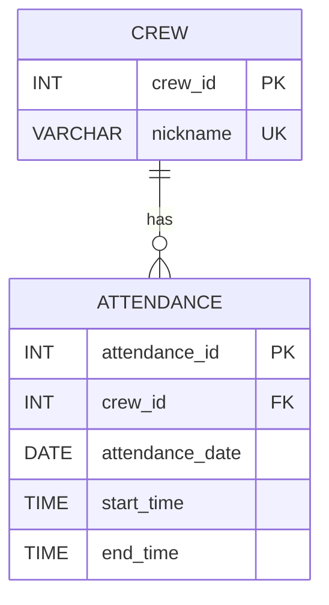

# DB 문제 정답

문제 6~9의 `어셔`, `주니`, `아론`은 제공된 시드 데이터에 없어서, `crew` 테이블에는 존재한다고 가정했다.

## 문제 1. 테이블 생성하기

- 중복되는 컬럼: `nickname`

```sql
CREATE TABLE `crew` (
  `crew_id` INT NOT NULL AUTO_INCREMENT,
  `nickname` VARCHAR(50) NOT NULL,
  PRIMARY KEY (`crew_id`)
);

INSERT INTO `crew` (`crew_id`, `nickname`)
SELECT DISTINCT `crew_id`, `nickname`
FROM `attendance`
ORDER BY `crew_id`;
```

## 문제 2. 테이블 컬럼 삭제하기

- 삭제할 컬럼: `attendance.nickname`

```sql
ALTER TABLE `attendance`
DROP COLUMN `nickname`;
```

## 문제 3. 외래키 설정하기

```sql
ALTER TABLE `attendance`
ADD CONSTRAINT `fk_attendance_crew`
FOREIGN KEY (`crew_id`) REFERENCES `crew` (`crew_id`)
ON DELETE RESTRICT
ON UPDATE CASCADE;
```

## 문제 4. 유니크 키 설정

```sql
ALTER TABLE `crew`
ADD CONSTRAINT `uq_crew_nickname`
UNIQUE (`nickname`);
```

## 문제 5. 크루 닉네임 검색하기

```sql
SELECT `nickname`
FROM `crew`
WHERE `nickname` LIKE '디%';
```

## 문제 6. 출석 기록 확인하기

```sql
SELECT
  c.`nickname`,
  a.`attendance_date`,
  a.`start_time`,
  a.`end_time`
FROM `crew` AS c
LEFT JOIN `attendance` AS a
  ON a.`crew_id` = c.`crew_id`
 AND a.`attendance_date` = '2025-03-06'
WHERE c.`nickname` = '어셔';
```

## 문제 7. 누락된 출석 기록 추가

```sql
INSERT INTO `attendance` (`crew_id`, `attendance_date`, `start_time`, `end_time`)
SELECT
  c.`crew_id`,
  '2025-03-06',
  '09:31',
  '18:01'
FROM `crew` AS c
WHERE c.`nickname` = '어셔'
  AND NOT EXISTS (
    SELECT 1
    FROM `attendance` AS a
    WHERE a.`crew_id` = c.`crew_id`
      AND a.`attendance_date` = '2025-03-06'
  );
```

## 문제 8. 잘못된 출석 기록 수정

```sql
UPDATE `attendance`
SET `start_time` = '10:00'
WHERE `crew_id` = (
  SELECT `crew_id`
  FROM `crew`
  WHERE `nickname` = '주니'
)
AND `attendance_date` = '2025-03-12';
```

## 문제 9. 허위 출석 기록 삭제

```sql
DELETE FROM `attendance`
WHERE `crew_id` = (
  SELECT `crew_id`
  FROM `crew`
  WHERE `nickname` = '아론'
)
AND `attendance_date` = '2025-03-12';
```

## 문제 10. 출석 정보 조회하기 (JOIN)

```sql
SELECT
  c.`nickname`,
  a.`attendance_date`,
  a.`start_time`,
  a.`end_time`
FROM `attendance` AS a
JOIN `crew` AS c
  ON c.`crew_id` = a.`crew_id`
WHERE c.`nickname` = '검프'
ORDER BY a.`attendance_date`;
```

## 문제 11. nickname으로 쿼리 처리하기 (서브쿼리)

```sql
SELECT *
FROM `attendance`
WHERE `crew_id` = (
  SELECT `crew_id`
  FROM `crew`
  WHERE `nickname` = '검프'
)
ORDER BY `attendance_date`;
```

## 문제 12. 가장 늦게 하교한 크루 찾기

```sql
SELECT
  c.`nickname`,
  a.`end_time`
FROM `attendance` AS a
JOIN `crew` AS c
  ON c.`crew_id` = a.`crew_id`
WHERE a.`attendance_date` = '2025-03-05'
ORDER BY a.`end_time` DESC
LIMIT 1;
```

## 문제 13. 크루별로 기록된 날짜 수 조회

```sql
SELECT
  c.`nickname`,
  COUNT(a.`attendance_date`) AS `recorded_days`
FROM `crew` AS c
LEFT JOIN `attendance` AS a
  ON a.`crew_id` = c.`crew_id`
GROUP BY c.`crew_id`, c.`nickname`
ORDER BY c.`crew_id`;
```

## 문제 14. 크루별로 등교 기록이 있는 날짜 수 조회

```sql
SELECT
  c.`nickname`,
  COUNT(a.`start_time`) AS `days_with_start_time`
FROM `crew` AS c
LEFT JOIN `attendance` AS a
  ON a.`crew_id` = c.`crew_id`
GROUP BY c.`crew_id`, c.`nickname`
ORDER BY c.`crew_id`;
```

## 문제 15. 날짜별로 등교한 크루 수 조회

```sql
SELECT
  `attendance_date`,
  COUNT(DISTINCT `crew_id`) AS `crew_count`
FROM `attendance`
WHERE `start_time` IS NOT NULL
GROUP BY `attendance_date`
ORDER BY `attendance_date`;
```

## 문제 16. 크루별 가장 빠른 등교 시각과 가장 늦은 등교 시각

```sql
SELECT
  c.`nickname`,
  MIN(a.`start_time`) AS `earliest_start_time`,
  MAX(a.`start_time`) AS `latest_start_time`
FROM `crew` AS c
LEFT JOIN `attendance` AS a
  ON a.`crew_id` = c.`crew_id`
GROUP BY c.`crew_id`, c.`nickname`
ORDER BY c.`crew_id`;
```

## 생각해 보기

### 기본키란 무엇이고 왜 필요한가?

기본키는 테이블의 각 레코드를 유일하게 식별하는 컬럼이다. 기본키가 없으면 특정 행을 정확히 수정하거나 삭제하기 어렵고, 중복 데이터와 참조 무결성 문제가 생기기 쉽다.

### MySQL에서 AUTO_INCREMENT는 왜 필요한가?

새 행이 들어올 때마다 사람이 직접 ID를 관리하지 않아도 되게 해 준다. 중복 없는 식별자를 자동으로 발급하므로 입력 실수를 줄이고 삽입 로직을 단순하게 만든다.

### NULL 값을 처리할 때 주의할 점은?

`NULL`은 0이나 빈 문자열과 다르다. 비교할 때 `= NULL`이 아니라 `IS NULL` 또는 `IS NOT NULL`을 사용해야 하고, 집계나 화면 표시 시 `NULL`을 어떻게 보여줄지 별도로 정해야 한다.

### crew와 attendance 테이블의 관계를 ER 다이어그램으로 시각화해보자



일상 비유로는 `학생`과 `출석부` 관계에 가깝다. 학생 한 명은 여러 번 출석하지만, 하나의 출석 기록은 한 학생에게만 속한다.

### 동시에 100명이 등교 버튼을 누르면 어떤 일이 일어날까?

동시에 많은 요청이 들어오면 같은 데이터에 대한 경합이 생길 수 있다. 트랜잭션은 각 요청을 하나의 작업 단위로 묶고, ACID의 원자성은 일부만 저장되는 상황을 막고, 격리성은 서로의 처리 과정이 충돌하지 않게 보장한다.

### 출석 데이터를 파일이 아니라 데이터베이스에 저장하는 이유는?

데이터베이스는 검색, 동시성 제어, 권한 관리, 무결성 제약, 백업과 복구에 유리하다. CSV 같은 파일로 관리하면 중복과 불일치가 쉽게 생기고 동시에 여러 사용자가 수정할 때 충돌 처리도 어렵다.

### NoSQL로 저장한다면 어떻게 달라질까?

예를 들어 MongoDB라면 크루 문서 안에 출석 배열을 넣거나, 출석 컬렉션을 별도로 둘 수 있다. 스키마 변경이 유연하다는 장점이 있지만, 현재처럼 구조가 명확하고 조인이 중요한 데이터는 관계형 DB가 더 직관적이고 무결성 관리도 쉽다.

## 더 생각해 보기

### 왜 crew 테이블에서 nickname을 기본키로 하지 않았을까?

닉네임은 업무 규칙상 유니크하더라도 변경 가능성이 있는 자연키다. 반면 `crew_id`는 의미가 없는 대리키라서 변경 가능성이 낮고 다른 테이블에서 참조하기 쉽다.

### attendance 테이블에 attendance_id가 존재하는 이유는 무엇일까?

출석 기록 하나하나를 고유하게 식별하기 위해서다. 같은 크루가 여러 날짜에 출석하고, 같은 날짜에도 예외 처리로 데이터 수정이 일어날 수 있기 때문에 별도 식별자가 있는 편이 안전하다.

### RESTRICT와 CASCADE는 무엇인가?

- `RESTRICT`: 참조 중인 자식 행이 있으면 부모 행 수정 또는 삭제를 막는다.
- `CASCADE`: 부모 키가 바뀌거나 삭제될 때 자식 행에도 그 변경을 연쇄 적용한다.

### 서브쿼리와 JOIN은 어떤 성능 차이가 있을까?

서브쿼리는 읽기 쉬운 경우가 있지만, 상황에 따라 중간 결과를 따로 계산해야 할 수 있다. `JOIN`은 옵티마이저가 더 다양한 실행 계획을 선택하기 쉬워 일반적으로 관계 조회에서 유리한 경우가 많다. 다만 최종 성능은 인덱스, 데이터 양, DB 엔진에 따라 달라진다.

```sql
-- 서브쿼리
SELECT *
FROM attendance
WHERE crew_id IN (
  SELECT crew_id
  FROM crew
  WHERE nickname LIKE '네%'
);

-- JOIN
SELECT a.*
FROM attendance AS a
JOIN crew AS c
  ON a.crew_id = c.crew_id
WHERE c.nickname LIKE '네%';
```

### 완전 정규화와 일부 비정규화의 장단점은?

정규화는 중복을 줄이고 수정 이상을 방지하며 무결성을 높인다. 반대로 일부 비정규화는 조회 시 조인을 줄여 성능을 높일 수 있지만, 중복 데이터 동기화 비용이 커진다.

### 연결 풀링(connection pooling)은 무엇이고 왜 필요한가?

애플리케이션이 DB 연결을 매번 새로 열고 닫지 않고, 미리 만들어 둔 연결을 재사용하는 방식이다. 연결 생성 비용을 줄이고 동시에 많은 요청이 들어와도 자원을 안정적으로 관리할 수 있다.

### INSERT, UPDATE, DELETE를 하나의 트랜잭션으로 묶는다면?

```sql
START TRANSACTION;

INSERT INTO `attendance` (`crew_id`, `attendance_date`, `start_time`, `end_time`)
VALUES (13, '2025-03-06', '09:31', '18:01');

UPDATE `attendance`
SET `start_time` = '10:00'
WHERE `attendance_id` = 100;

DELETE FROM `attendance`
WHERE `attendance_id` = 101;

COMMIT;
```

도중에 오류가 나면 `ROLLBACK` 해야 한다. 그러면 앞서 성공했던 `INSERT`와 `UPDATE`도 함께 취소되어 데이터 일관성이 유지된다.
